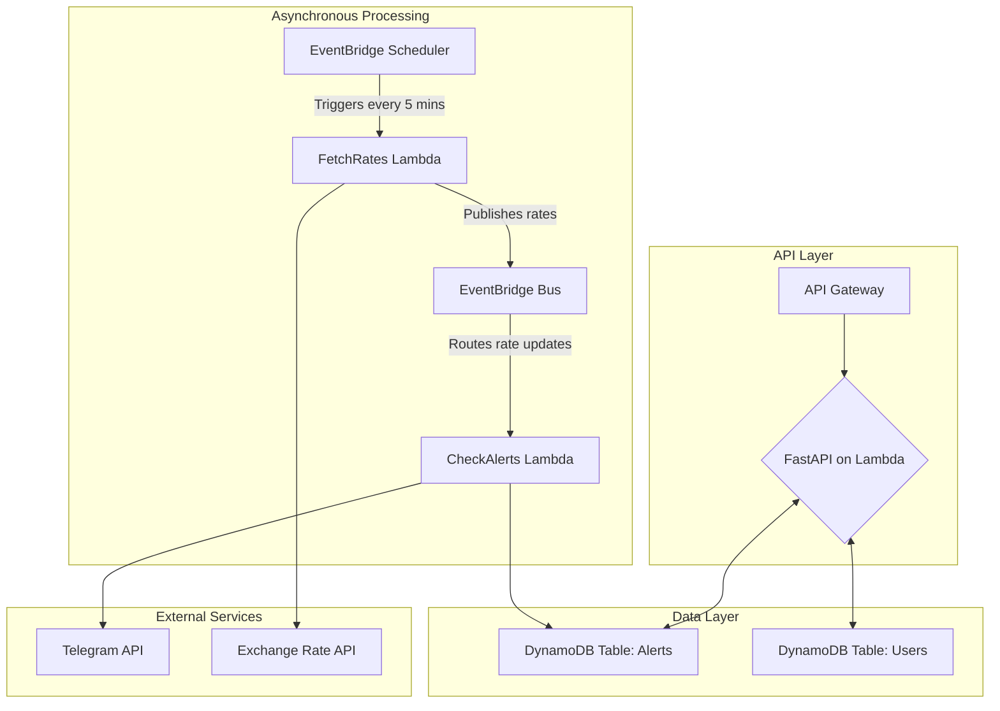

# AWS Currency Tracking & Alert Platform

I put this project together out of curiosity and a desire to deepen my grasp of AWS services I seldom use day to day—Lambda, EventBridge, DynamoDB, FastAPI on API Gateway—and to understand how they collaborate in a realistic setting. It’s a practical playground that tracks currency rates, pings Telegram when targets hit, and lets me show how I approach event-driven design and wire up cloud infrastructure with backend code.

## Project Overview

- **Objective**: explore AWS-native, event-driven patterns while recreating a real-world alerting workflow.
- **Scope**: REST API for managing alert definitions, scheduled rate ingestion, event-driven alert evaluation, Telegram notifications.
- **Why it matters**: demonstrates familiarity with serverless architectures, asynchronous processing, and AWS IAM/DynamoDB best practices in a compact but realistic application.

## Tech Stack

- **Language & Framework**: Python 3.11, FastAPI, Mangum
- **AWS Services**: Lambda, API Gateway, EventBridge Scheduler + Bus, DynamoDB, IAM
- **Infrastructure as Code**: AWS SAM (`template.yaml`)
- **Messaging & Integrations**: Telegram Bot API, public exchange-rate providers
- **Tooling**: pip-based workflow, ready for `ruff` + `pytest` + CI (to be added in upcoming commits)

## Architecture

The platform follows a "thin API, rich event pipeline" model. FastAPI focuses on CRUD + authentication, while background Lambdas handle periodic rate ingestion and alert fan-out through EventBridge. DynamoDB provides low-latency persistence for both alerts and user metadata.



## Core Features

1. **Alert Management API**
   - JWT-based authentication endpoints for registering/logging in users.
   - CRUD operations for alert definitions (base/target currency, thresholds, trigger direction).
2. **Automated Rate Collection**
   - Scheduled Lambda (`fetch_rates`) pulls data from public exchange-rate providers and posts standardized events.
3. **Event-Driven Alert Evaluation**
   - `check_alerts` Lambda consumes rate events, evaluates user rules, and dispatches Telegram notifications.
4. **Security & Configuration**
   - Secrets supplied via AWS SAM parameters (`KOREAEXIM_AUTHKEY`, Telegram token, JWT secret).
   - Granular IAM policies scoped per Lambda.

## Local Setup

```bash
git clone https://github.com/leeinprogress/aws-currency-tracker.git
cd aws-currency-tracker
python -m venv .venv && source .venv/bin/activate
pip install -r requirements.txt
cp .env.example .env  # fill in API keys + Telegram token
```

## Deployment (SAM)

```bash
sam build
sam deploy --guided
```

SAM will prompt for all runtime secrets and provision the full stack (API Gateway, Lambdas, DynamoDB tables, EventBridge resources).

## Roadmap

- **Next commits**: 
  - Comprehensive pytest suite with moto-powered AWS mocks.
  - GitHub Actions workflow for lint → test gates.
  - Documentation bundle (architecture notes, troubleshooting, runbook).

Feedback and suggestions are welcome—this project is my playground for trying new cloud patterns, and I plan to keep iterating.
